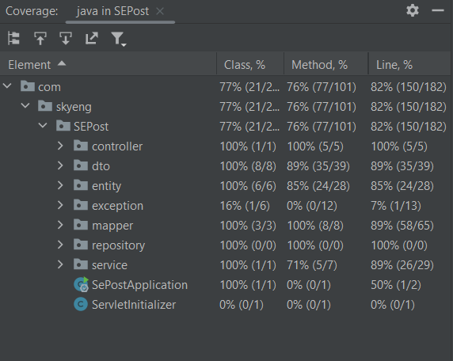

# SEPost

### Файл war находится в корневой папке

## Description
SEPost - приложение, в котором можно  регистрировать почтовые отправления — письма, посылки — их передвижение между почтовыми отделениями.
Реализована возможность регистрации, обновления статуса почтового отправления(прибытие, убытие, получение адресатом), а также возможность получения информации и всей истории передвижения конкретного почтового отправления.

## Tech Stack 🔧
[](https://www.oracle.com/java/) [](https://spring.io/projects/spring-framework) [](https://docs.oracle.com/javase/tutorial/jdbc/overview/index.html) [](https://www.postgresql.org/) [](https://junit.org/junit5/docs/current/user-guide/)
[](https://maven.apache.org/) [](https://www.docker.com/) [](https://swagger.io/)

## How to set up the project ▶

1) Склонируйте репозиторий
```
git clone https://github.com/Antroverden/SEPost.git
```
2) Для создания war архива введите в консоли(будет сгенерирован в папку target)
```
mvn clean package
```
3) Убедитесь, что у вас запущен Docker и запустите проект в Intellij IDEA

После запуска проекта в Intellij IDEA примеры HTTP-запросов к контроллерам можно увидеть по ссылке:
```
http://localhost:8080/swagger-ui/index.html
```

Скриншот тестового покрытия:



Скриншоты описания API — структура запросов и ответов, список допустимых операций(более подробно по адресу http://localhost:8080/swagger-ui/index.html при запущенном приложении в Intellij IDEA):

